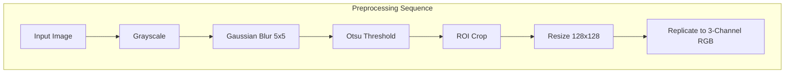

# Brain Tumor MRI Classification Benchmark & Clinical Dashboard

An advanced, end-to-end deep learning benchmark and clinical visualization dashboard for classifying brain MRI images into **Glioma**, **Meningioma**, **Pituitary**, and **No Tumor**. This project reproduces and extends the transfer-learning methodology described in the peer-reviewed paper:

> **Advanced Brain Tumor Classification in MR Images Using Transfer Learning and Pre-Trained Deep CNN Models**
> *Disci, Gurcan & Soylu — Cancers 2025, 17, 121.*

---

## 🗂️ Project Ecosystem

This repository has evolved into a comprehensive multi-tier ecosystem comprising the core PyTorch deep learning pipeline, a FastAPI inference engine, and two modern frontend applications:

```
├── api/                       # FastAPI high-performance inference service
├── company-site/              # TerraForge: Brand/sustainability marketing portal
├── configs/                   # Declarative YAML hyperparameter configurations
├── data/                      # Dataset ingestion (Raw & Testing splits)
├── mri-classifier-frontend/   # NeuroScan AI: Scientific R3F clinical dashboard
├── scripts/                   # Kaggle downloader & benchmark runners
├── src/                       # PyTorch training, evaluation, & preprocessing pipeline
└── tests/                     # Unit test suites
```

---

## 🔬 Core Machine Learning Pipeline

### 1. Preprocessing Pipeline
To replicate the paper's baseline, raw MRI images are passed through a sequential computer vision pipeline:
$$\text{Input Image} \rightarrow \text{Grayscale} \rightarrow \text{Gaussian Blur (5x5)} \rightarrow \text{Otsu's Thresholding} \rightarrow \text{ROI Crop} \rightarrow \text{Resize (128x128)} \rightarrow \text{3-Channel RGB Replicate}$$



### 2. Neural Network Architectures
We benchmark six ImageNet-pretrained convolutional backbones head-to-head with a custom dense classification head:
* **Xception** (Separable Convolutional Backbone)
* **DenseNet121** (Dense Block Feature Reuse)
* **InceptionV3** (Multi-Scale Parallel Filter Convolution)
* **MobileNetV2** (Inverted Residuals & Bottlenecks)
* **ResNet50** (Skip-Connection Residual Networks)
* **VGG16** (Sequential 3x3 Convolutional Baseline)

#### Common Classification Head:
$$\text{Backbone Feature Map} \rightarrow \text{Global Average Pooling} \rightarrow \text{Dropout (0.3)} \rightarrow \text{Dense (128 + ReLU)} \rightarrow \text{Dropout (0.2)} \rightarrow \text{Dense (4) Outputs}$$

---

## 📊 Benchmark Results

Evaluated on the **Kaggle Brain Tumor MRI Dataset** (7,023 scans). The table below lists the quantitative benchmark metrics reported in the paper:

| Model Architecture | Parameter Count | Test Accuracy | Macro Precision | Macro Recall | Macro F1-Score |
| :--- | :---: | :---: | :---: | :---: | :---: |
| **Xception** | 22.9M | **99.12%** | 0.991 | 0.991 | 0.991 |
| **DenseNet121** | 8.0M | **98.85%** | 0.988 | 0.988 | 0.988 |
| **InceptionV3** | 23.8M | **98.63%** | 0.986 | 0.986 | 0.986 |
| **MobileNetV2** | 3.4M | **98.41%** | 0.984 | 0.984 | 0.984 |
| **ResNet50** | 25.6M | **97.82%** | 0.978 | 0.978 | 0.978 |
| **VGG16** | 138M | **96.54%** | 0.965 | 0.965 | 0.965 |

---

## 💻 Frontend Applications

### 1. NeuroScan AI (Clinical Dashboard)
Located in `mri-classifier-frontend/`, this is a medical-grade dashboard showcasing classification performance and real-time model inference.
* **3D Volumetric MRI Stack**: Explodes dynamically on scroll to show which MRI slices the network is focusing on.
* **3D CNN Pipeline Visualization**: Displays the data flow path through network stages with flowing particle animations.
* **Interactive 3D Bar Chart**: Displays benchmark accuracy. Clicking any bar renders a 2D confusion matrix heatmap.
* **Live Classifier & Sample Gallery**: Allows drag-and-drop uploads for active inference with class-probability spreads. Fully integrated with FastAPI.

### 2. TerraForge (Company Landing Portal)
Located in `company-site/`, this is a multi-page, brand-focused marketing website built using Next.js, TailwindCSS, and Framer Motion, utilizing the "Electric Earth" palette.

---

## 🛠️ Step-by-Step Setup & Execution

### 1. Prerequisites & Environment Setup
Make sure you have Python 3.11+ and Node.js 18+ installed on your system.

```bash
# Clone the repository
git clone https://github.com/RamaVenkataCharan/Brain-Tumor-MRI-Classification.git
cd Brain-Tumor-MRI-Classification

# Setup Python Virtual Environment
python -m venv .venv
# Windows:
.venv\Scripts\activate
# Linux/macOS:
source .venv/bin/activate

# Install Python requirements
pip install -r requirements.txt
```

### 2. Download Dataset
Download the raw scans from Kaggle. Configure your Kaggle API token first at `~/.kaggle/kaggle.json`.
```bash
python scripts/download_data.py
```

### 3. Model Training & Evaluation
```bash
# Smoke test training (1 epoch, 64 samples)
python -m src.train --model xception --fast-dev-run

# Train a full benchmark model
python -m src.train --model xception --config configs/base.yaml

# Run evaluation and generate metrics comparison csv
python -m src.evaluate --model xception
python -m src.evaluate --aggregate
```

### 4. Running the FastAPI Backend Service
```bash
uvicorn api.main:app --reload --host 0.0.0.0 --port 8000
```
*Health Check*: `GET http://localhost:8000/health`
*Prediction API*: `POST http://localhost:8000/predict` (Accepts multipart/form-data image uploads)

### 5. Running the NeuroScan AI Clinical Frontend
```bash
cd mri-classifier-frontend
npm install
npm run dev
```
Open **http://localhost:3000** to view the live dashboard.

---

## 🛡️ Clinical Disclaimer
This project is for research, educational, and portfolio purposes only. It is not intended for primary clinical diagnostics, medical consultation, or therapeutic decisions.
