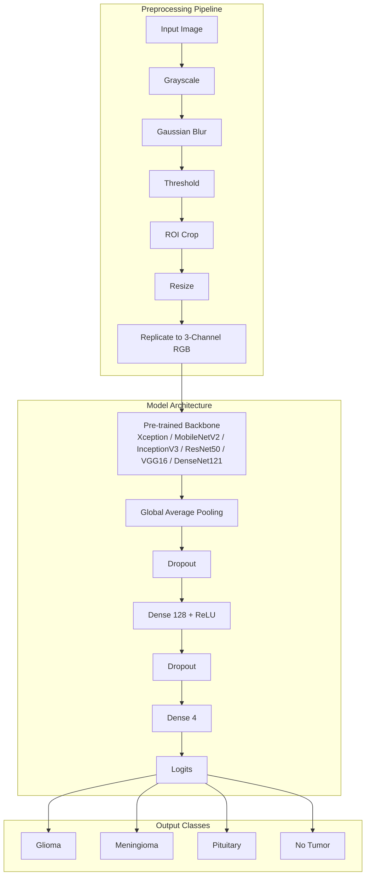

# Brain Tumor MRI Classification

Transfer learning benchmark for classifying brain MRI images into **Glioma**, **Meningioma**, **Pituitary**, and **No Tumor**, reproducing and extending the methodology from:

> Disci, Gurcan & Soylu — *Advanced Brain Tumor Classification in MR Images Using Transfer Learning and Pre-Trained Deep CNN Models* (Cancers 2025, 17, 121)

Six ImageNet-pretrained backbones are compared head-to-head: **Xception**, **MobileNetV2**, **InceptionV3**, **ResNet50**, **VGG16**, **DenseNet121**.

## Features

- Paper-faithful preprocessing pipeline (grayscale → blur → threshold → ROI crop → resize), replicated to 3-channel RGB for timm backbones
- Composable, toggleable preprocessing/augmentation stages via YAML config
- Shared classification head (Dropout → Dense(128) → Dropout → logits)
- Training with Adam (lr=1e-4), batch size 20, 5 epochs (all configurable)
- Full metrics: per-class P/R/F1, confusion matrices, comparison table + bar chart
- FastAPI inference endpoint
- Optional Weights & Biases logging (`--use-wandb`)
- CUDA + mixed precision support

## Architecture



## Project Structure

```
configs/                  # YAML configs (base + per-model overrides)
src/
  data/                   # Dataset, preprocessing, augmentation
  models/                 # Backbone registry + classifier wrapper
  train.py                # Training CLI
  evaluate.py             # Evaluation + aggregation CLI
  inference.py            # Single-image predictor
  utils/                  # Config, metrics, visualization, logging
api/main.py               # FastAPI service
scripts/                  # Dataset download + benchmark runners
tests/                    # pytest unit tests
notebooks/                # Exploratory analysis
```

## Setup

### 1. Create environment (Python 3.11+)

```bash
python -m venv .venv
# Windows
.venv\Scripts\activate
# Linux/macOS
source .venv/bin/activate

pip install -r requirements.txt
```

### 2. Download dataset

Uses [Kaggle Brain Tumor MRI Dataset](https://www.kaggle.com/datasets/masoudnickparvar/brain-tumor-mri-dataset) (Masoud Nickparvar) via `kagglehub`.

Configure Kaggle credentials at `~/.kaggle/kaggle.json` (or `%USERPROFILE%\.kaggle\kaggle.json` on Windows):

```json
{"username": "YOUR_USERNAME", "key": "YOUR_API_KEY"}
```

```bash
python scripts/download_data.py
```

Expected layout:

```
data/raw/
  Training/{glioma,meningioma,notumor,pituitary}/*.jpg
  Testing/{glioma,meningioma,notumor,pituitary}/*.jpg
```

Validate only:

```bash
python scripts/download_data.py --validate-only
```

## Training

Train a single model:

```bash
python -m src.train --model xception --config configs/base.yaml
```

Smoke test (1 epoch, 64 samples):

```bash
python -m src.train --model xception --fast-dev-run
```

Useful flags:

| Flag | Description |
|------|-------------|
| `--epochs N` | Override epoch count |
| `--batch-size N` | Override batch size |
| `--lr FLOAT` | Override learning rate |
| `--augment-extended` | Enable flips + rotation beyond paper baseline |
| `--imagenet-norm` | Use ImageNet mean/std (deviates from paper's [0,1] norm) |
| `--use-wandb` | Enable Weights & Biases |
| `--no-amp` | Disable mixed precision |

## Evaluation

Evaluate one model:

```bash
python -m src.evaluate --model xception
```

Aggregate all trained models into `results/comparison.csv` + bar chart:

```bash
python -m src.evaluate --aggregate
```

## Run All 6 Models

**Linux/macOS:**

```bash
bash scripts/run_all_models.sh
```

**Windows (PowerShell):**

```powershell
.\scripts\run_all_models.ps1
```

Outputs per model under `results/{model_name}/metrics.json` and `confusion_matrix.png`.

## FastAPI Inference

Train a model first, then start the API:

```bash
uvicorn api.main:app --reload --host 0.0.0.0 --port 8000
```

Predict:

```bash
curl -X POST "http://localhost:8000/predict" -H "accept: application/json" -H "Content-Type: multipart/form-data" -F "file=@path/to/mri.jpg"
```

Health check: `GET http://localhost:8000/health`

## Tests

```bash
pytest -v
```

## Implementation Notes (Deviations from Paper)

1. **Framework**: PyTorch + timm (paper used Keras). Architecture and hyperparameters are matched where possible.
2. **RGB channels**: Paper pipeline is grayscale; we replicate to 3 channels so ImageNet-pretrained backbones accept input. Toggle via `preprocessing.replicate_grayscale_to_rgb`.
3. **Normalization**: Paper uses [0,1] scaling. ImageNet backbones often benefit from mean/std normalization — disabled by default, enable with `--imagenet-norm`.
4. **Output activation**: PyTorch uses logits + `CrossEntropyLoss` instead of Softmax + categorical cross-entropy (mathematically equivalent for training).
5. **Weighted/macro accuracy avg**: Paper formula is ambiguous. We define:
   - `weighted_accuracy_avg = (n_train·acc_train + n_test·acc_test) / (n_train + n_test)`
   - `macro_accuracy_avg = (acc_train + acc_test) / 2`
   See `src/utils/metrics.py` for details.
6. **Batch size 20**: Paper default; small for modern GPUs — increase via `--batch-size` or config.
7. **InceptionV3**: timm supports variable input sizes; paper used 128×128.

## Adding New Backbones

Register in `src/models/registry.py`:

```python
register_backbone("efficientnet_b0", "efficientnet_b0")
```

Then add `configs/models/efficientnet_b0.yaml` and train with `--model efficientnet_b0`.

## License

Research/educational use. Dataset subject to Kaggle dataset license terms.
